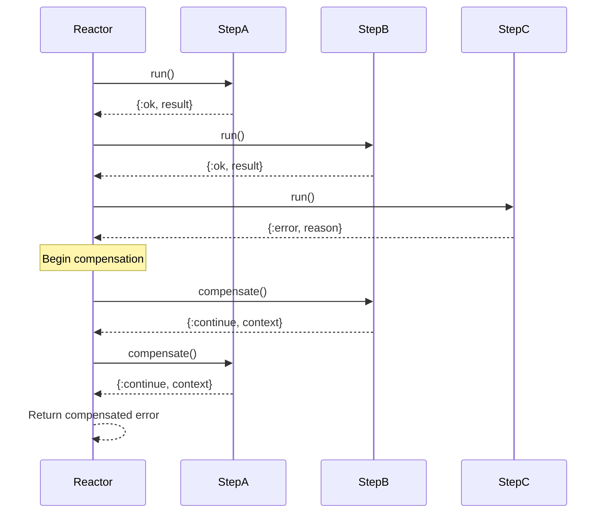

# Error Handling with Compensation and Undo

In this tutorial, you'll learn how to make your reactors resilient by adding proper error handling, retry logic, and rollback capabilities.

## What you'll build

You'll enhance the user registration workflow from the first tutorial to handle:
1. Network failures with automatic retries
2. Validation errors with graceful failure
3. Rollback scenarios when later steps fail
4. Email service failures with compensation

## You'll learn

- Implementing compensation for retryable errors
- Adding undo logic for rollback scenarios
- The difference between compensation and undo
- Building resilient workflows that handle failures gracefully

## Error Handling Flow

Here's how Reactor handles errors through compensation and undo:



## Prerequisites

- Complete the [Getting Started tutorial](01-getting-started.md)
- Basic knowledge of Elixir error handling

## Step 1: Set up the project

If you don't have the project from the previous tutorial, create it:

```bash
mix igniter.new reactor_tutorial --install reactor
cd reactor_tutorial
```

## Step 2: Understanding Reactor error handling

Reactor provides two main mechanisms for error handling:

### Compensation
**When**: A step fails during execution  
**Purpose**: Decide whether to retry, continue, or fail the reactor  
**Return values**:
- `:retry` - Try the step again
- `{:continue, value}` - Continue execution with the provided value
- `:ok` - Successfully compensated, but still triggers rollback
- `{:error, reason}` - Fail the entire reactor

### Undo
**When**: A step succeeded but a later step failed  
**Purpose**: Roll back the successful step's changes  
**Return values**:
- `:ok` - Successfully undone
- `{:error, reason}` - Failed to undo (this will fail the reactor)

## Step 3: Create a step with error handling

Let's create a step that can fail and shows how to handle those failures. Create `lib/email_service.ex`:

```elixir
defmodule EmailService do
  use Reactor.Step

  @impl true
  def run(arguments, _context, _options) do
    if String.ends_with?(arguments.email, "@example.com") do
      {:ok, %{message_id: "msg_123", sent_at: DateTime.utc_now()}}
    else
      {:error, %{type: :network_timeout, message: "Email service unavailable"}}
    end
  end

  @impl true
  def compensate(error, _arguments, _context, _options) do
    case error do
      %{type: :network_timeout} ->
        # Network errors are usually temporary, so retry
        :retry
      
      _other ->
        # Other errors are permanent, don't retry
        :ok
    end
  end

  @impl true
  def undo(result, _arguments, _context, _options) do
    IO.puts("Canceling email message #{result.message_id}")
    :ok
  end
end
```

## Step 4: Create a database service that needs rollback

Create `lib/database_service.ex`:

```elixir
defmodule DatabaseService do
  use Reactor.Step

  @impl true
  def run(arguments, _context, _options) do
    user = %{
      id: :rand.uniform(10000),
      email: arguments.email,
      password_hash: arguments.password_hash,
      created_at: DateTime.utc_now()
    }
    
    {:ok, user}
  end

  @impl true
  def compensate(_error, _arguments, _context, _options) do
    # Database errors are usually retryable
    :retry
  end

  @impl true
  def undo(user, _arguments, _context, _options) do
    IO.puts("Rolling back user creation for #{user.email} (ID: #{user.id})")
    :ok
  end
end
```

## Step 5: Build a reactor with error handling

Now create `lib/resilient_user_registration.ex`:

```elixir
defmodule ResilientUserRegistration do
  use Reactor

  input :email
  input :password

  step :validate_email do
    argument :email, input(:email)
    
    run fn %{email: email}, _context ->
      if String.contains?(email, "@") and String.length(email) > 5 do
        {:ok, email}
      else
        {:error, "Email must contain @ and be longer than 5 characters"}
      end
    end
  end

  step :hash_password do
    argument :password, input(:password)
    
    run fn %{password: password}, _context ->
      if String.length(password) >= 8 do
        hashed = :crypto.hash(:sha256, password) |> Base.encode16()
        {:ok, hashed}
      else
        {:error, "Password must be at least 8 characters"}
      end
    end
  end

  step :create_user, DatabaseService do
    argument :email, result(:validate_email)
    argument :password_hash, result(:hash_password)
    max_retries 3
  end

  step :send_welcome_email, EmailService do
    argument :email, result(:validate_email)
    argument :user, result(:create_user)
    max_retries 2
  end

  step :send_admin_notification, EmailService do
    argument :email, value("admin@company.com")
    argument :user, result(:create_user)
    max_retries 1
  end

  return :create_user
end
```

## Step 6: Test the error handling

Let's test our reactor in IEx:

```bash
iex -S mix
```

```elixir
# Test with a valid @example.com email (should succeed)
{:ok, user} = Reactor.run(ResilientUserRegistration, %{
  email: "alice@example.com",
  password: "secretpassword123"
})

# Test with a non-@example.com email (will trigger retry logic)
{:error, reason} = Reactor.run(ResilientUserRegistration, %{
  email: "bob@gmail.com",
  password: "secretpassword123"
})

# Test with invalid inputs
{:error, reason} = Reactor.run(ResilientUserRegistration, %{
  email: "bad",
  password: "short"
})
```

## Step 7: Understanding the behaviour

When you run the tests, you'll see different behaviours:

**Successful execution** (with @example.com email): All steps succeed, user is created and emails are sent.

**Retry scenario** (with non-@example.com email): EmailService fails with network timeout, compensation returns `:retry`, step retries up to max_retries limit.

**Validation failures**: Invalid input fails immediately without retries - compensation logic determines these are permanent errors.


## What you learned

You now understand Reactor's error handling mechanisms:

- **[Compensation](../reference/glossary.md#compensation)** handles step failures with retry logic
- **Undo operations** roll back successful steps when later steps fail
- **Max retries** controls how many times compensation can retry a step
- **Error types** should be handled differently (retry vs fail)
- **Context contains retry state** for intelligent retry logic

## What's next

Now that you can handle errors, you're ready for more advanced concepts:

- **[Async Workflows](03-async-workflows.md)** - Explore concurrent processing patterns
- **[Composition](04-composition.md)** - Build complex workflows with sub-reactors  
- **[Testing Strategies](documentation/how-to/testing-strategies.md)** - Learn how to test error scenarios

## Common issues

**Steps retry infinitely**: Always set `max_retries` and ensure compensation doesn't always return `:retry`

**Undo operations fail**: Make undo operations idempotent - they should succeed even if called multiple times

**Reactor fails instead of retrying**: Check that your compensation function returns `:retry`, not `{:error, reason}`

Happy building resilient workflows! 🛡️
